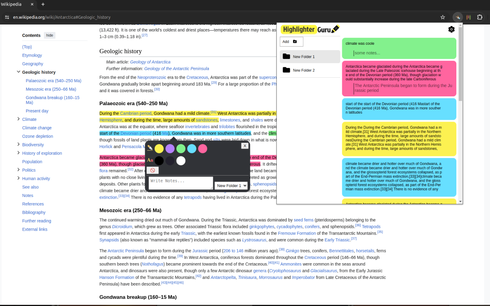

# Highlighter Guru - Text Highlighting Extension for Chrome

introducing "Highlighter Guru" - a free and open source Text Highlighting Extension for Chrome

[Store Link](https://chromewebstore.google.com/detail/highlighter-guru/efikihnnclcchnlkcenaeilncbbbdmmd)

## Introduction

Welcome to **Highlighter Guru**, a free and open-source text highlighting extension for Chrome. This extension aims to enhance your web browsing experience by providing a simple yet powerful tool for highlighting and organizing text on any web page.

## How to Use

1. **Select the Text:** Highlight the text you want to save or make a note of on any web page.
2. **Press 'h' on Your Keyboard:** Instantly apply your chosen highlight to the selected text.
3. **Right-Click for More Options:** Explore additional options by right-clicking on any highlighted text. Edit, add notes, or organize it into folders – all with a few clicks.

## Main Features
- **Easy Highlighting:** Just press 'h' after selecting any text on a webpage to highlight it quickly.
- **Personalization:** Customize your reading experience with different colors and fonts for highlighting.
- **Folder Organization:** Create folders to keep your highlights organized and easy to find.
- **Notes and Comments:** Add notes to your highlights to remember important points or thoughts.
- **Keyboard Shortcuts:** Set shortcuts to make using Highlighter Guru even easier.
- **Right-Click Options:** Access extra features by right-clicking on highlighted text, like editing or deleting.

## Contributing

Feel free to contribute by reporting issues, suggesting new features, or creating pull requests. See [CONTRIBUTING.md](CONTRIBUTING.md) for more details.
